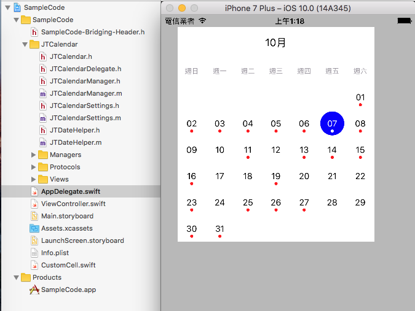

# JTCalendar_swift_Sample

A Demo code for import JTCalendar(objc) to Swift 2.3 project

## Author

* [MoeMoe](https://github.com/twofishsman) 

## Reference

* http://stackoverflow.com/questions/36912065/how-to-use-jtcalendar-in-swift
* by Hasya san
